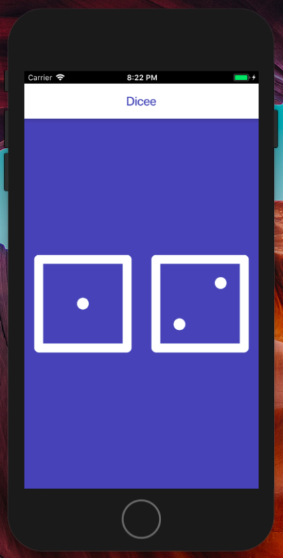

# Dicee Flutter 🎲

A dice shaking app made with flutter

## Flutter used concepts

- Stateless widgets
- Stateful widgets
- Material Widgets
- Layout Widgets
- Event Listeners.
- Setstate to modify app state.
